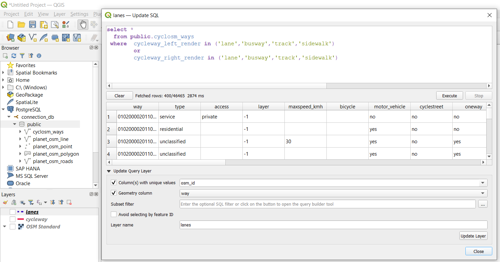
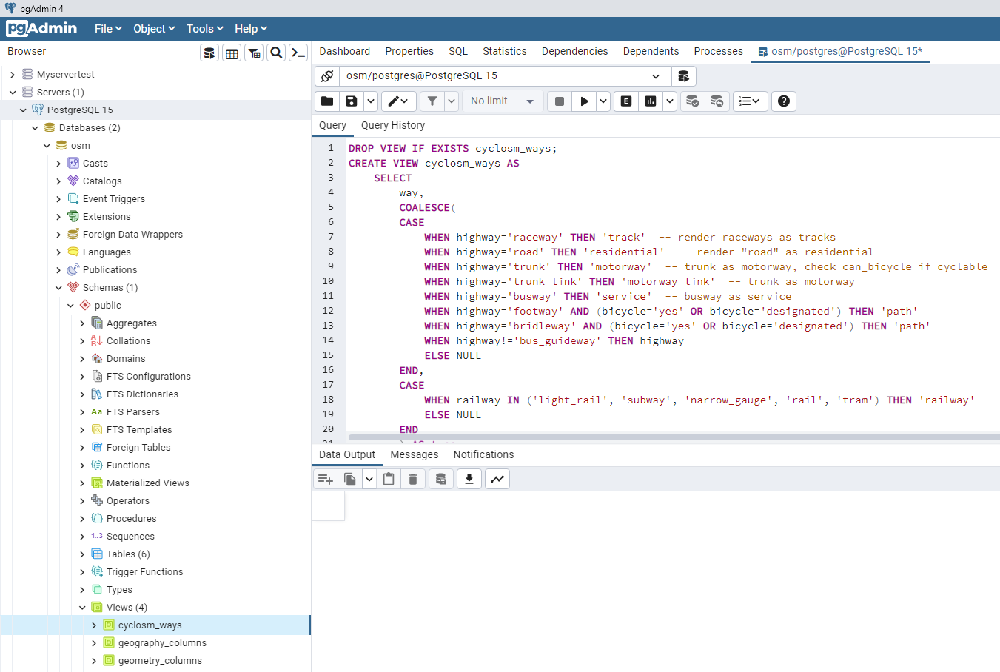

# **OSM_bicyle_Road Projet** 

## **Getting started**

 This document describe how to manually install, configure and deploy the environement for running OSM_bicyle_Road Projet. 

### **Requirements**
 You will need, to installed for use this style:

>* QGIS
>* PostgreSQL
>* PostGIS 
>* Htsore
>* Osm2pgsql
>* OSM Data geofabrik
>* OSM style file
 

### **0. Donwload and install QGIS:**

QGIS is a software package for creating, editing, viewing, analysing and publishing geospatial information.

> 1. The first step is to donwload QGIS : use this [ link](https://www.qgis.org/fr/site/forusers/download.html) 
> 2. Install QGIS: installation is quite simple, just click on next until the end.

Donwload QGIS        |  Install QGIS
:-------------------------:|:-------------------------:
 | 

### **1. PostgreSQL and PostGIS**

In this part, we donwload and install PostgreSQL, PostGIS and Htsore after that we create a database to use to store osm data.

 > 1.   Donwload PostgreSQL [Here](https://www.enterprisedb.com/downloads/postgres-postgresql-downloads)

 > 2.   Install PostgreSQL double clik on the setup and after this provide a password for the database superuser postgress we use default password admin. use default port 5432

Spatial Extensions         |  Select PostGIS           |       Select PostGIS
:-------------------------:|:-------------------------:|:-------------------------:
 |   |   

 > 3.  Install PostGIS for this: click on spatial Extensions and select the last version of PostGIS 

Spatial Extensions         |  Select PostGIS           |       Select PostGIS
:-------------------------:|:-------------------------:|:-------------------------:
 |   |   

After do next->next->next->next and all yes and last do finish. 

### **2. Create database**

> 0. Open pgAdmin 
> 1. Clik on the dropdown list **(Servers(1))** and insert your **password**
> 2. Do a rigth-click on **PostgreSQL 15** and select **Create-->Database.....**
> 3. Insert the Name of new database and clik on `Save`. 

1        |  2         |       3
:-------------------------:|:-------------------------:|:-------------------------:
 |   |   

 ### **3. Enable postgis and hstore**     

>1. In your name of database do a rigth-click and select **Query Tool**
>2.  In Query dasboard  copy and execute one by one the two following codes to enable postgis and hstore on your database : 
~~~~sql
    CREATE extension postgis;
 ~~~~
 ~~~~sql
      CREATE extension hstore;
 ~~~~
            
>3. If everything is successful, clik oon **Extensions** you will see hstore and postgis. 

Query dasboard           |  Check 
:-------------------------:|:-------------------------:
 | 

### **4 Donwloads Osm2pgsql, OSM Data geofabrik and OSM style file**

 > 1. For Osm2pgsql, we use prebuilt binaries for this you can download prebuilt binaries in this [link](https://osm2pgsql.org/download/windows/)
 >> Donwload the the latest version and unpack the ZIP file and you can immediately use osm2pgsql.

> 2. Osm2pgsql requires the use of a custom OSM style file to define which tags are included in the database during import. 
 >>You can download the default style file [here](https://github.com/openstreetmap/osm2pgsql/blob/master/default.style).

> 3. GeoFabrik is a company which specializes in working with OpenStreetMap. 
They provide a variety of free extracts in raw OSM format on their download website.
The advantage of downloading GeoFabrik data is that it is updated every day, and it’s easy and reliable. One disadvantage is that the data is extracted by country, and not all countries are available.
>>For our projet we use OpenStreetMap data for Belgium, you can download OSM_data/osm2pgsql in this  [link](https://download.geofabrik.de/europe/belgium.html) to donwloads file with **.pbf**

### **5 Import data in Postgis database using Osm2pgsql**

We will use the database you created in the previous chapter to store our data.\
To import the data, we will run the osm2pgsql program via the command line.

Here we will run the application osm2pgsql with several options. We need at least to supply it with:

1. The location of the OSM Data File
2. The name of the database, and the database username
3. The style file which defines which OSM tags will be imported to the database

 Type the following command in the command line, before replacing the location of the OSM file and style file with your own.

> location\osm2pgsql-bin\osm2pgsql.exe -c -d database -u user -w  -h localhost -j -s location\default.style location\belgium-latest.osm.pbf \
`For example : 
C:\Users\Hugues.Kamto.Kamden\Downloads\osm2pgsql-bin\osm2pgsql.exe -c -d lakamtale -u postgres -w  -h localhost -j -s C:\Users\Hugues.Kamto.Kamden\Downloads\default.style C:\Users\Hugues.Kamto.Kamden\Downloads\belgium-latest.osm.pbf `

Press Enter and insert de password of the database. 

If all goes well, the process should begin running. It may take a few minutes for all of the data to load into the database.

 

### **6 TESTINT IT**

We can test that the import was successful and view the data in our database using QGIS that we install in the first part.

Open QGIS and in the left part make rigth-click on the “PostgreSQL”  and choice new connection option 

- Insert name of the new connection
- Insert the Host and  Database ().
- Cick on ok and Enter the username and password. 
- Click OK to save the connection settings. 

 1           |  2 
:-------------------------:|:-------------------------:
 | 

After that: 

Then click on PostgreSQL connect to your PostgreSQL server.
Click to  “public” to see all of the layers (tables) in your database. 
Notice that osm2pgsql creates a separate table for different object types - points, lines, and polygons. 
It also creates a roads table, which contains only major roads.

Click to one or more of the layers to see the plots and If is the first time choose WGS84 as the CRS (on bottom in right).

In menu of QGIS clik on Plugins and Install Plugins...
Search QuickMapServices and click install Plugin

In menu of QGIS clik on Web and QuickMapServices --->OSM--->OSM Standard

   Install Plugins         |  Choose WGS84 as the CRS
:-------------------------:|:-------------------------:
 | 

If everything is successful, you will see the layers you selected displayed in QGIS

 

Other option we can quilkly test if the import was successful for this we can use Pgadmin. 
open pgadmin clik on  Server clik on PostgreSQL clik on your database clik Schemas and clik on Tables.
If everything is successful, you will see the layers you selected displayed in QGIS

 

### **7 OSM_bicyle_Road**

#### **7.0 create view cyclosm_ways**

For our projet, we use the `view cyclosm_ways` for the **cyclosm-cartocss-style** projet. cyclosm-cartocss-style  is a new cyc84le-oriented render , contrary to OpenCycleMap, this render is free and open-source software and aims at being more complete to take into account a wider diversity of cycling habits, this views provides all the ways of the country.  

That you can see or download the file code to create view [there](https://github.com/hugues237/OSM_bicyle_Road/blob/main/source_code/cyclosm_ways.sql)

Once this has been done: 
- Open pgadmin clik and connect in database.
- Make rigth-click on database and select query tools
- Copy an paste the code sql in the file and excute the query
 - You can see the view in views

### **7.1 Lanes and Cycleways**

In order to create our the lanes and cycleways layouts in QGIS base on our previous view,

- Open QGIS and make clik on the PostgreSQL
- Choice  connection and  make right-clik on the connection 
- Choice option 'Execute SQl...'  a new window will be opened

#### **Lanes**
For the lane in the new window that opened copy and paste the SQL following source code: 
~~~~sql
select *
  from public.cyclosm_ways
 where  cycleway_left_render in ('lane','busway','track','sidewalk')
        or  
		cycleway_right_render in ('lane','busway','track','sidewalk') 
~~~~

- Click to the button Execute in the bottom 
- After execution clik to the 'Load as new layer' 
- And  for the list of check boxes select "columns with unique values" and "geometry column" 
- change the name of the layer optional. 
- At the end click on "Load Layer" in bottom

#### **Cycleways**

For the creation of layout cylcleways, the steps are the same that for the  Lanes 
just replace only the the preview code by the following code : 

~~~~sql
select *
  from public.cyclosm_ways
 where type ='cycleway'
             and 
            (bicycle not in ('no','use_sidepath','delivery','permit','permissive','destination','mtb','military','dismount','customers','undefined','discouraged','no|designated','unknown') or bicycle is null)
			       and 
             cycleway_left_render is null 
             and  
		        cycleway_right_render is null 			 
union

select *
  from public.cyclosm_ways
 where segregated ='yes'
        and 
        (cycleway_left_render is null 
        and  
		    cycleway_right_render is null )
		    and 
		    type not in ('cycleway')
~~~~

If everything is successful, you will see the layers you selected displayed in QGIS 

### **8. Computes lenght Lanes and Cycleways per commune**

To compute the length of cycleways or lanes per commune follow the following steps: 
 > Add communes-belges-2019.geojson layer in QGIS for this: 
   
  - You can download the geojson file in this [link](https://github.com/hugues237/OSM_bicyle_Road) 
  - In QGIS click on the "Layer" menu, mouse-over "Add Layer" and click "Add Vector Layer..."  
- If the geojson you have are on your local machine, all you need to do is click on the Browse button and navigate to the folder where your geojson are. 
- Clik on add wait few secondes after clik on add Layers

> Use function to compute length in polygons

- In the search bar in botton located in  the left Sum line clik on  the function "Sum line lengths"
- In the case Polygons choice the name of layer that represents communes-belges
- In lines choice **the name of layer that represents lanes to compute lenght lane by commune** or choice **the name of layer that represents cycleways if you want to compute length cycle ways by commune**  and clik on **run** 
- After execution clik on close.

### **9.Parsings and export the two files in .csv**

In this section, we perform some processing on the obtained layout in order to export a .csv file with the postal code of the commune, the name of the commune, the distance in meters and kilometres.

To do this you can follow This video [link](https://www.awesomescreenshot.com/video/16123894?key=56badd5a6861db1aab7a444c0ab6bf17) which explains the case of the lane. 

The process is the same for cycleways. 